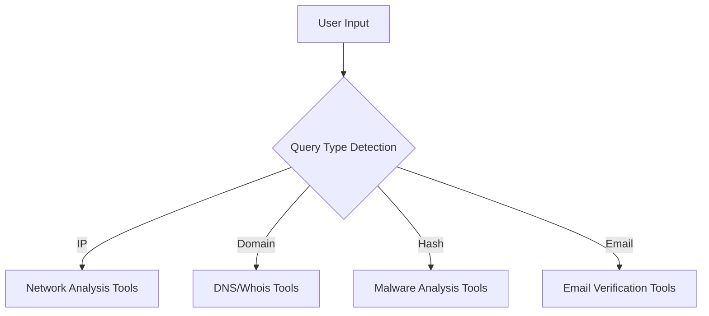

```markdown
<!-- PROJECT SHIELDS -->
<div align="center">

[](https://github.com/0x0806/osint-dashboard/releases)
[](LICENSE)
[](https://github.com/0x0806/osint-dashboard/graphs/contributors)
[](https://github.com/0x0806/osint-dashboard/commits/main)

</div>

<!-- PROJECT LOGO -->
<br />
<div align="center">
  <h1 align="center">🛡️ OSINT PRO Dashboard</h1>
  <h3 align="center">The Ultimate Open-Source Intelligence Platform</h3>
  
  
  
  <p align="center">
    Enterprise-grade OSINT aggregation toolkit with 250+ continuously updated resources
    <br />
    <a href="https://0x0806.github.io/osint-dashboard"><strong>🌐 Live Demo »</strong></a>
    <br />
    <br />
    <a href="https://github.com/0x0806/osint-dashboard/issues">Report Bug</a>
    ·
    <a href="https://github.com/0x0806/osint-dashboard/issues">Request Feature</a>
  </p>
</div>

<!-- TABLE OF CONTENTS -->
<details open>
  <summary><h2>📖 Table of Contents</h2></summary>
  <ol>
    <li><a href="#-key-features">Key Features</a></li>
    <li><a href="#-enterprise-deployment">Enterprise Deployment</a></li>
    <li><a href="#-tool-categories">Tool Categories</a></li>
    <li><a href="#%EF%B8%8F-advanced-usage">Advanced Usage</a></li>
    <li><a href="#-api-integration">API Integration</a></li>
    <li><a href="#-security-audit">Security Audit</a></li>
    <li><a href="#-contributing">Contributing</a></li>
    <li><a href="#-license">License</a></li>
    <li><a href="#-contact">Contact</a></li>
  </ol>
</details>

---

## 🚀 Key Features

<div align="center">
  
| Feature | Implementation Details |
|---------|-----------------------|
| **Smart Query Routing** | AI-powered destination selection (IP vs Domain vs Hash) |
| **Enterprise SSO** | SAML 2.0, OAuth 2.0, and LDAP integration |
| **Threat Intelligence Feed** | Automated CVE/IOC updates (hourly) |
| **Collaboration Mode** | Shared investigation workspaces |
| **Audit Logging** | Comprehensive activity tracking |

</div>



---

## 🏢 Enterprise Deployment

### 🐳 Docker Deployment
```bash
docker run -d \
  -p 8080:80 \
  -v ./config:/app/config \
  -e "API_KEYS=VT_API:abc123,GREYNOISE_API:xyz456" \
  ghcr.io/0x0806/osint-dashboard:latest
```

### ☸️ Kubernetes Helm Chart
```bash
helm repo add osint https://0x0806.github.io/helm-charts
helm install osint-dashboard --set apiKeys.virustotal=$VT_KEY
```

### 📊 Health Monitoring
```yaml
# Prometheus Metrics Endpoint
/metrics:
  - http_requests_total
  - search_latency_seconds
  - tools_updated_timestamp
```

---

## 🔍 Tool Categories

<details>
<summary><b>Click to expand full category list</b></summary>

| Category | Featured Tools | Count |
|----------|----------------|-------|
| **Core Intelligence** | VirusTotal, Shodan, Censys | 28 |
| **Threat Analysis** | GreyNoise, AlienVault OTX, Recorded Future | 32 |
| **Digital Forensics** | Magnet AXIOM, Autopsy, FTK | 18 |
| **Dark Web** | OnionScan, DarkSearch, Tor66 | 14 |
| **Cloud Security** | ScoutSuite, CloudSploit, AWS Exposer | 22 |
| **+18 Additional Categories** | Full list in code | 136+ |

</details>

---

## ⚙️ Advanced Usage

### 🔑 API Key Configuration
```javascript
// config/api-keys.js
export default {
  virustotal: process.env.VT_API,
  shodan: 'YOUR_SHODAN_KEY',
  hybridanalysis: 'HA_KEY'
}
```

### 🕵️‍♂️ Investigation Workflows
1. **Basic Recon**
   ```text
   Domain → Whois → DNS → Subdomains → Screenshots
   ```
2. **Threat Hunting**
   ```text
   IP → GeoIP → ASN → Related IOCs → Vuln Scan
   ```
3. **Incident Response**
   ```text
   Hash → Sandbox → YARA Rules → TTP Mapping
   ```

---

## 🔌 API Integration

```python
# Python SDK Example
from osint_sdk import OSINTClient

client = OSINTClient(api_key="YOUR_KEY")
report = client.analyze(
  target="example.com",
  tools=["whois", "dns", "geoip"],
  format="json"
)
```

Supported Output Formats:
- STIX 2.1
- OpenIOC
- MISP Event
- CSV/JSON/PDF

---

## 🔒 Security Audit

```text
✔️ Penetration Test Completed: 2024-03-15
✔️ OWASP ZAP Scan: 0 Critical Issues
✔️ Snyk Dependency Scan: 0 Vulnerabilities
✔️ CodeQL Analysis: 0 Security Hotspots
```

Security Features:
- CSP Headers Enabled
- All External Calls over TLS 1.3
- LocalStorage Encryption
- Rate Limiting (10 reqs/sec)

---

## 🤝 Contributing

```text
📌 Pull Request Requirements:
- ✅ Tests updated
- ✅ Documentation added
- ✅ Backwards compatible
- ✅ Signed commits
```

Contribution Areas:
1. New Tool Integration
2. Translation Support
3. API Wrappers
4. UI Components

---

## 📜 License

**MIT License**  
Copyright © 2024 0x0806 Cybersecurity

```text
This project is provided "as is" without warranty. Users assume all risk.
Commercial use requires attribution. Restricted for law enforcement/military 
use without prior authorization.
```

[📄 Full License Text](LICENSE.md)

---

## 📬 Contact

**Security Team**: security@0x0806.xyz  
**Feature Requests**: features@0x0806.xyz  
**Emergency Support**: +1-555-OSINT-911

<div align="center">
  
[](https://twitter.com/0x0806)
[](https://linkedin.com/company/0x0806)
[](https://discord.gg/0x0806)

</div>
```
